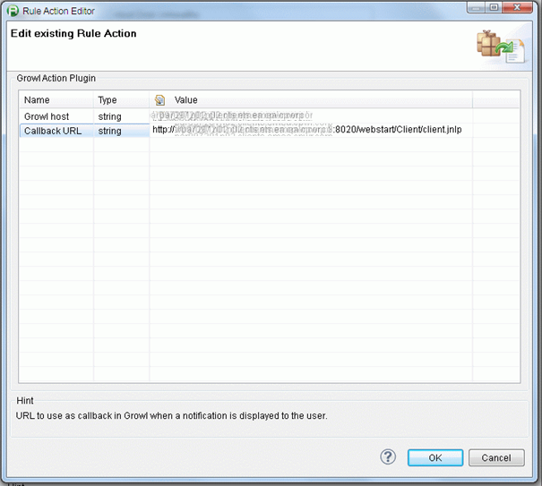
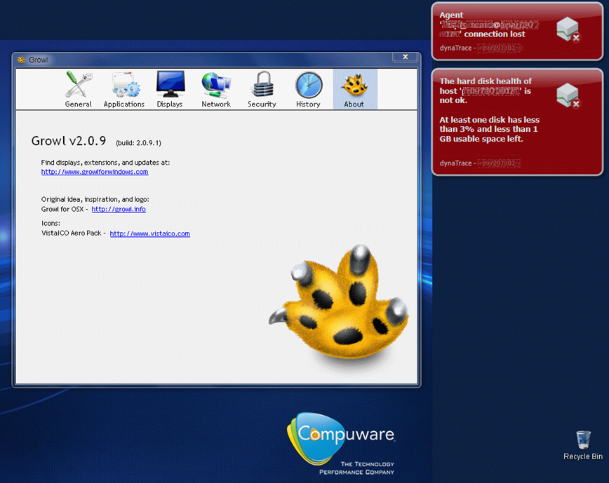

# Growl Alerting Plugin

## Overview

This plugin allows **sending dynaTrace incidents to Growl over the network**.  
Growl Action plugin works with :

  * Growl on Mac (http:/www.growl.info) 

  * [Growl on Windows](http://www.growlforwindows.com/gfw/)

  * [Growl on Linux](http://mattn.github.io/growl-for-linux/)

  * [Snarl on Windows](http://snarl.fullphat.net/)

NB: from Growl you can even forward notifications to:

  * [Toasty on Windows Phone](http://blog.growlforwindows.com/2010/10/toasty-notifications-for-windows-phone.html)

  * [Prowl on iOS](http://www.prowlapp.com/)

  * [Growl on Android](https://play.google.com/store/apps/details?id=com.growlforandroid.client&hl=en)

| Name |Growl Alerting Plugin
| :--- | :---
| Author | Laurent Izac (laurent.izac@compuware.com)
| Supported dynaTrace Version | >= 5.5
| License | [dynaTrace BSD](dynaTraceBSD.txt)
| Support | [Not Supported ](https://community.compuwareapm.com/community/display/DL/Support+Levels#SupportLevels-Community)

Download

Plugin binary : [com.dynatrace.diagnostics.plugins.growl_1.0.1.jar](attachments_123896085_1_com.dynatrace.diagnostics.plugins.growl_1.0.1.jar)

Version

1.0.0

## Installation

  * On the dynaTrace server side, import the plugin jar file and activate the plugin (see [Plugin Management](https://community/display/DOCDT55/Plugin+Management)). 

  * Then, you need to add the Growl Action Plugin in the 'Extended Actions' of each of the incidents you want to generate Growl alerts for. 

## Usage

In Growl's settings, you can configure how you want to display different severities:

Sample notifications (click to enlarge):  

