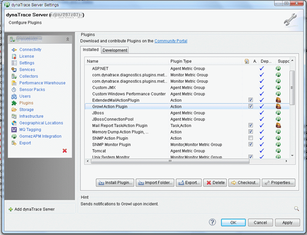

<html xmlns="http://www.w3.org/1999/xhtml">
<head>
    <title>Growl Alerting Plugin</title>
    <meta http-equiv="Content-Type" content="text/html; charset=UTF-8"/>
    <meta http-equiv="X-UA-Compatible" content="IE=EmulateIE8" />
    <meta content="Scroll Wiki Publisher" name="generator"/>
    <link type="text/css" rel="stylesheet" href="css/blueprint/liquid.css" media="screen, projection"/>
    <link type="text/css" rel="stylesheet" href="css/blueprint/print.css" media="print"/>
    <link type="text/css" rel="stylesheet" href="css/content-style.css" media="screen, projection, print"/>
    <link type="text/css" rel="stylesheet" href="css/screen.css" media="screen, projection"/>
    <link type="text/css" rel="stylesheet" href="css/print.css" media="print"/>
</head>
<body>
                <h1>Growl Alerting Plugin</h1>
    

        <h2>Overview</h2>
    

            
            

    

This plugin allows <strong class=" ">sending dynaTrace incidents to Growl over the network</strong>. Growl Action plugin works with :    

<ul class=" "><li class=" ">    

Growl on Mac (http:/www.growl.info)    

</li><li class=" ">    

<a href="http://www.growlforwindows.com/gfw/">Growl on Windows</a>    

</li><li class=" ">    

<a href="http://mattn.github.io/growl-for-linux/">Growl on Linux</a>    

</li><li class=" ">    

<a href="http://snarl.fullphat.net/">Snarl on Windows</a>    

</li></ul>    

NB: from Growl you can even forward notifications to:    

<ul class=" "><li class=" ">    

<a href="http://blog.growlforwindows.com/2010/10/toasty-notifications-for-windows-phone.html">Toasty on Windows Phone</a>    

</li><li class=" ">    

<a href="http://www.prowlapp.com/">Prowl on  iOS</a>    

</li><li class=" ">    

<a href="https://play.google.com/store/apps/details?id=com.growlforandroid.client&amp;hl=en">Growl on Android</a>    

</li></ul>    

        <table>
<thead class=" "></thead><tfoot class=" "></tfoot><tbody class=" ">    <tr>
            <td rowspan="1" colspan="1">
        

Name    

            </td>
                <td rowspan="1" colspan="1">
        

<strong class=" ">Growl Alerting Plugin</strong>    

            </td>
        </tr>
    <tr>
            <td rowspan="1" colspan="1">
        

Version    

            </td>
                <td rowspan="1" colspan="1">
        

1.0.0    

            </td>
        </tr>
    <tr>
            <td rowspan="1" colspan="1">
        

dynaTrace Version    

            </td>
                <td rowspan="1" colspan="1">
        

5+    

            </td>
        </tr>
    <tr>
            <td rowspan="1" colspan="1">
        

Author    

            </td>
                <td rowspan="1" colspan="1">
        

Laurent Izac (laurent.izac@compuware.com)    

            </td>
        </tr>
    <tr>
            <td rowspan="1" colspan="1">
        

Download    

            </td>
                <td rowspan="1" colspan="1">
        

Plugin binary : <a href="attachments_123896085_1_com.dynatrace.diagnostics.plugins.growl_1.0.1.jar">com.dynatrace.diagnostics.plugins.growl_1.0.1.jar</a>    

            </td>
        </tr>
    <tr>
            <td rowspan="1" colspan="1">
        

License    

            </td>
                <td rowspan="1" colspan="1">
        

<a href="attachments_5275722_2_dynaTraceBSD.txt">dynaTrace BSD</a>    

            </td>
        </tr>
    <tr>
            <td rowspan="1" colspan="1">
        

Support    

            </td>
                <td rowspan="1" colspan="1">
        

<a href="https://community/display/DL/Support+Levels#SupportLevels-Community">Not Supported </a>    

            </td>
        </tr>
</tbody>        </table>
            

    

    

        <h2>Installation</h2>
<ul class=" "><li class=" ">    

On the dynaTrace server side, import the plugin jar file and activate the plugin (see <a href="https://community/display/DOCDT55/Plugin+Management">Plugin Management</a>).    

</li></ul>    

            
            

<ul class=" "><li class=" ">    

Then, you need to add the Growl Action Plugin in the 'Extended Actions' of each of the incidents you want to generate Growl alerts for.    

</li></ul>    

            
            

    

    

        <h2>Usage</h2>
    

In Growl's settings, you can configure how you want to display different severities:    

    

            
            

    

Sample notifications (click to enlarge):             
            

    

            
            

    

            

        

        

        

    

</body>
</html>
